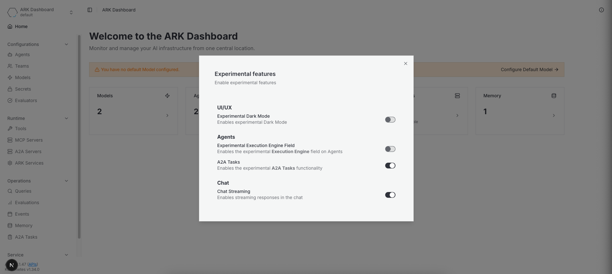

### ⚠️ Enabling Experimental Features

From the Experimental Features Dialog, you can toggle experimental features on or off.

This allows you to try out new and upcoming features before they are officially released. Please note that these features are still under development and may be unstable.

You can open the Experimental Features Dialog by pressing on the "Experimental Feature" settings button on the UI or through the `CMD+E` (or `CTRL+E` shortcut).

